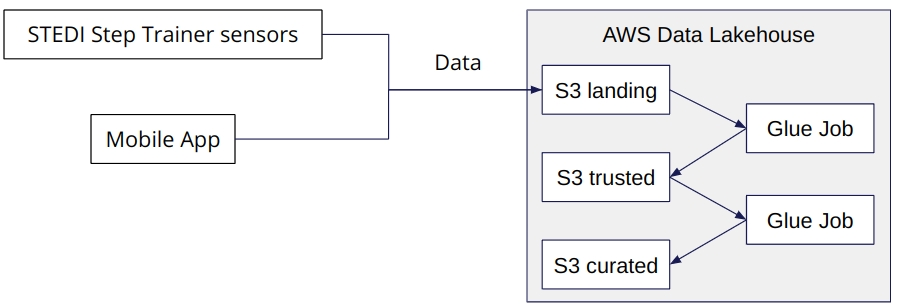

# Project: Spark and Data Lakes

## STEDI Human Balance Analytics

Build a data lakehouse solution for sensor data that trains a machine learning model.

### Details

The STEDI Team has been hard at work developing a hardware **STEDI Step Trainer** that:

- trains the user to do a STEDI balance exercise;
- and has sensors on the device that collect data to train a machine-learning algorithm to detect steps;
- has a companion mobile app that collects customer data and interacts with the device sensors.

STEDI has heard from millions of early adopters who are willing to purchase the STEDI Step Trainers and use them.

Several customers have already received their Step Trainers, installed the mobile application, and begun using them together to test their balance. The Step Trainer is just a motion sensor that records the distance of the object detected. The app uses a mobile phone accelerometer to detect motion in the X, Y, and Z directions.

The STEDI team wants to use the motion sensor data to train a machine learning model to detect steps accurately in real-time. Privacy will be a primary consideration in deciding what data can be used.

Some of the early adopters have agreed to share their data for research purposes. **Only these customers’ Step Trainer and accelerometer data should be used in the training data for the machine learning model.**

### Summary

Extract the data produced by the STEDI Step Trainer sensors and the mobile app, and curate them into a data lakehouse solution on AWS so that Data Scientists can train the learning model.

### Project Data

STEDI has [three JSON data sources](https://github.com/udacity/nd027-Data-Engineering-Data-Lakes-AWS-Exercises/tree/main/project/starter) to use from the Step Trainer.
- `customer` (_This is the data from fulfillment and the STEDI website._)
- `step_trainer` (_This is the data from the motion sensor._)
- `accelerometer` (_This is the data from the mobile app._)

The data has been downloaded and kept in `data` directory.

## Implementation

### Workflow



#### The Data Lakehouse consists of Three Zones:

- `landing`: raw ingested data
- `trusted`: data from the landing zone after some filtering, cleaning, and/or augmenting
- `curated`: some business-level aggregations on the trusted data.

### Upload data to S3 bucket using CloudShell

```bash
aws s3 mb s3://stedi-lake-house-nd027
git clone https://github.com/udacity/nd027-Data-Engineering-Data-Lakes-AWS-Exercises.git
cd nd027-Data-Engineering-Data-Lakes-AWS-Exercises/project/starter

aws s3 cp --recursive customer s3://stedi-lake-house-nd027/customer
aws s3 cp --recursive accelerometer s3://stedi-lake-house-nd027/accelerometer
aws s3 cp --recursive step_trainer s3://stedi-lake-house-nd027/step_trainer
```

### Configure S3 gateway entrypoint and set permissions.

See [AWS.md](./AWS.md)

### Load S3 Data into Landing Tables using Glue and Athena

#### Create a database in the Glue Dashboard

- Navigate to `Glue Dashboard > Data Catalog (side menu) > Databases`
- Create `steadi` database.

#### Import data to tables using AWS Athena Query Editor

1. Add `s3://stedi-lake-house-nd027/athena/` to 'Query result location and encryption' in Settings.
   - Assign bucket owner full control over query results

2. Create landing tables
   - `Create` > `Create a table from data source` > `S3 bucket data`
   - table_names: `customer_landing`, `accelerometer_landing` and `step_trainer_landing`
   - existing database: `steadi`
   - location of input data set
      - `s3://stedi-lake-house-nd027/customer/landing/`
      - `s3://stedi-lake-house-nd027/accelerometer/landing/`
      - `s3://stedi-lake-house-nd027/customer/step_trainer/`
   - table type: `Apache Hive` and format: `JSON`
   - add respective columns.

3. Verify Import
   - `SELECT * FROM customer_landing;` > **956** records.
   - `SELECT * FROM accelerometer_landing;` > **81273** records.
   - `SELECT * FROM step_trainer_landing;` > **28680** records.
   - See [Screen Shots](./screen-shots) for details.

#### Dataset


#### Sanitize Customer and Accelerometer Data

1. Sanitize the Customer data from the Website (Landing Zone) and only store the Customer Records who agreed to share their data for research purposes (Trusted Zone)
   - A Glue job `customer_trusted_job.py` has been created using **Visual ETL**.
   - Created a Glue Table called **customer_trusted** > **482** records.

2. Sanitize the Accelerometer data from the Mobile App (Landing Zone) and only store Accelerometer Readings from customers who agreed to share their data for research purposes (Trusted Zone)
   - A Glue job `accelerometer_trusted_job.py` has been created using **Visual ETL**.
   - Created a Glue Table called **accelerometer_trusted** > **40981** records.

3. Respective screenshots have been taken. See [Screen Shots](./screen-shots) for details.

#### Curate Customer Data

Sanitize the Customer data (Trusted Zone) and create a Glue Table (Curated Zone) that only includes customers who have accelerometer data and have agreed to share their data for research called customers_curated.
- A Glue job `customers_curated_job.py` has been created using **Visual ETL**.
- Created a Glue Table called **customer_curated** > **482** records.

#### Sanitize `step_trainer` and Curate `machine_learning` Data

1. Read the Step Trainer IoT data stream (S3) and populate a Trusted Zone Glue Table called **step_trainer_trusted** that contains the Step Trainer Records data for customers who have accelerometer data and have agreed to share their data for research (customers_curated).
   - A Glue job `step_trainer_trusted_job.py` has been created using **Visual ETL**.
   - Created a Glue Table called **step_trainer_trusted** > **14460** records.

2. Create an aggregated table that has each of the Step Trainer Readings, and the associated accelerometer reading data for the same timestamp, but only for customers who have agreed to share their data, and make a glue table called **machine_learning_curated**.
   - A Glue job `machine_learning_curated_job.py` has been created using **Visual ETL**.
   - Created a Glue Table called **machine_learning_curated** > **43681** records.

3. Respective screenshots have been taken. See [Screen Shots](./screen-shots) for details.

### Project Structure

```bash
.
├── assets
├── data            # S3 Bucket Copy
│   ├── accelerometer
│   │   ├── landing
│   │   └── trusted
│   ├── customer
│   │   ├── curated
│   │   ├── landing
│   │   └── trusted
│   ├── machine_learning
│   │   └── curated
│   └── step_trainer
│       ├── landing
│       └── trusted
├── glue_jobs       # AWS Glue Jobs Scripts 
├── glue_tables     # SQL Scripts to Create Tables in Athena
└── screen-shots    # Screen shots taken at several steps.
    ├── aws
    ├── jobs        # AWS Glue Jobs Editor
    └── tables      # AWS Athena Query Editor
```
